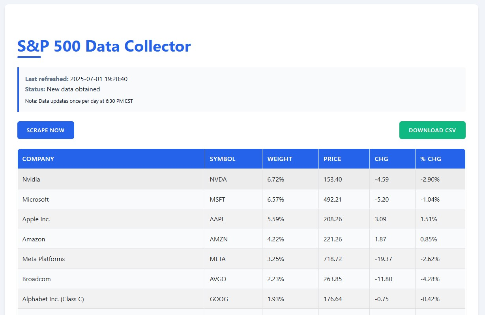

# 📊 S&P 500 Data Collector Web Application

[](https://sp500-scraper-app.onrender.com/)  
[](https://python.org)  
[](https://flask.palletsprojects.com)

A professional and responsive web application that scrapes and displays real-time S&P 500 stock data, complete with CSV export functionality for further analysis.



---

## Features

- **Real-time Data Collection**: Automatically scrapes the latest S&P 500 data from Slickcharts  
- **CSV Export**: Download current data with a single click  
- **Data Freshness Check**: Compares scraped content with existing data to prevent unnecessary overwrites  
- **Responsive Design**: Works seamlessly on desktop and mobile  
- **Error Handling**: Robust error handling and logging throughout the application  

---

## Technologies Used

- **Backend**: Python 3.12, Flask  
- **Web Scraping**: BeautifulSoup4, Requests  
- **Data Processing**: Pandas  
- **Frontend**: HTML, CSS  
- **Deployment**: Gunicorn (Heroku-ready)  
- **Infrastructure**: GitHub, Render  

---

## Project Structure

```
sp500-scraper-app/
├── app.py                  # Main Flask application  
├── sp500_collector.py      # Data collection coordinator  
├── scraper.py              # Web scraping logic  
├── file_operations.py      # CSV saving operations  
├── requirements.txt        # Python dependencies  
├── runtime.txt             # Python version specification  
├── templates/
│   └── index.html          # Main application template  
├── static/
│   └── styles.css          # Custom CSS styles  
└── README.md               # Project documentation  
```

---

## Key Functionality

### 📥 Data Collection Workflow

1. User initiates a scrape via the interface  
2. The application fetches HTML from [Slickcharts](https://www.slickcharts.com/sp500)  
3. BeautifulSoup parses the HTML table  
4. Pandas processes and cleans the data  
5. Data is saved to a timestamped CSV  
6. Results are displayed in a responsive table  

---

### ⚙️ Technical Highlights

- **Session Management**: Secure file download handling  
- **Error Logging**: Logs issues with clear error tracking  
- **File Sanitization**: Ensures safe and clean file naming  
- **Responsive UI**: Mobile-friendly interface  

---

## Future Enhancements

- [ ] Automated daily scraping  
- [ ] Historical data comparison  
- [ ] Stock performance charts  
- [ ] Email notification system  
- [ ] Portfolio tracking features  

---

## License

This project is licensed under the MIT License — meaning you're free to use, modify, and distribute it with attribution.  
See [LICENSE](LICENSE) for full terms.

---

**Developed by Dimitar Karaskakovski**  
[GitHub Portfolio](https://github.com/dimitar-sudo)
